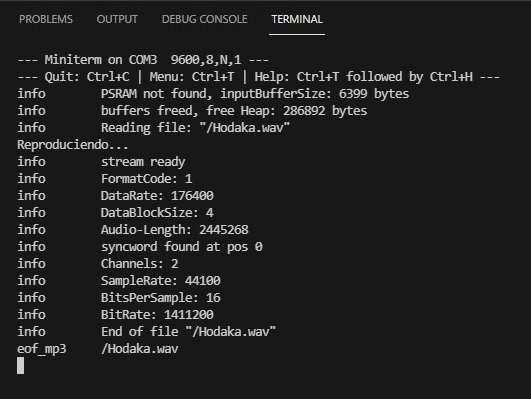

# PRACTICA 7 
### PARTE 2:
Siguiendo la programacion que se nos proporciona para realizar la practica podemos ver que la primera parte hacemos la definicion de las distintas librerias necesarias para su correcto funcionamiento seguido de la declaracion de un conjunto de 8 variables de distintos tipos las 4 primeras de estas son para los pines siguiendo la forma del VSPI para posterormente a traves de un comando que habra en el setup cambiar los pines de conexion de la SD de la forma predefinida por la libreria que se necesita para este que sigue el modelo HSPI en vez del VSPI que nosotros estamos poniendo en uso, las siguientes 3 variables estan relacionados con la librerias definidas que controlan el audio, por ultimo encontramos la variable que de audio la cual podremos configurar en el setup y nos repucira el archivo de forma infinita en el loop.
Seguidamente nos encontramos con el bloque del setup cuyo conjunto de comandos que hay en el empieza por configurar el modo del pin asignado a la variable SD_CS que lo ponmos de salida, posteriormente nos encontramos el comando digital write el cual hace que pase el voltaje de la ESP32 al componente que detecta en el pin asignado a la SD_CS el ultimo comando que nos encontramos con funcion de inicializar componentes es el comando SPI.begin(SPI_SCK, SPI_MISO, SPI_MOSI); el cual nos incia la conexion con la SD cambiando el modo de conexion de los pines de HSPI a VSPI que es el que utilizamos ya comentado donde se ecnuntran declarados esos pines y el morivo anteriormente. Siguiendo los comandos que componen el bloque del setup nos encontramos como es comun en todos los programas un serial.begin a la misma velocidad del monitor_speed que se encuentra en el .ini, siguido a este encontramos los distintos comandos que nos confiuran la variable de audio. El primero de ellos es el comando audio.setPinout(I2S_BCLK, I2S_LRC, I2S_DOUT) en el cual especificamos los pines a los cuales tendremos conectados la salida del componente I2S, el segundo de ellos es audio.setVolume(10); el cual nos limita/asigna con el volumen el cual sera reproducido nuestro audio propuesto y para finalizar con los comandos de configuracion del audio nos encontramos con el comando audio.connecttoFS(SD, "Dimitri Vegas & Like Mike, Martin Garrix - Tremor (Original Mix).mp3"); el cual nos importara el archivo de audio que se encuentra en la tarjeta de la SD. Para finalizar con el bloque del setup nos encontramos con un print hacia la terminal/monitor que informa que el audio se esta reproduciendo.
Seguido al bloque setup nos encontramos el bloque del loop el cual esta formado por un solo comando que es   audio.loop(); el cual iniciara el loop del variable/objeto de audio declarada y configurada previamente.
Para finlaizar el programa encontramos un conjunto de funciones las cuales tienen como objetivo mostrar por la terminal/monitor la informacion más especifica, es decir, la informacion tecnica del archivo en formato .wav que hemos guardado en la tarjeta SD previamente para su reproducion a traves de este programa.  
La salida del terminal de este programa no solo nos viene dada por el terminal si no que tambien por lo que podemos escuchar si conectamos el componente de la practica a un altavoz. En el caso de que lo conectemos podremos escuchar reproducise el audio asignado importado a traves de la SD, mientras que por la terminal solo observaremos una frase que nos informa que se esta reproduciendo este archivo juto a la informacion tecnica del archivo que esta reproduciendo a traves de este programa
Captura de lo observable a traves de la terminal/monitor: 

